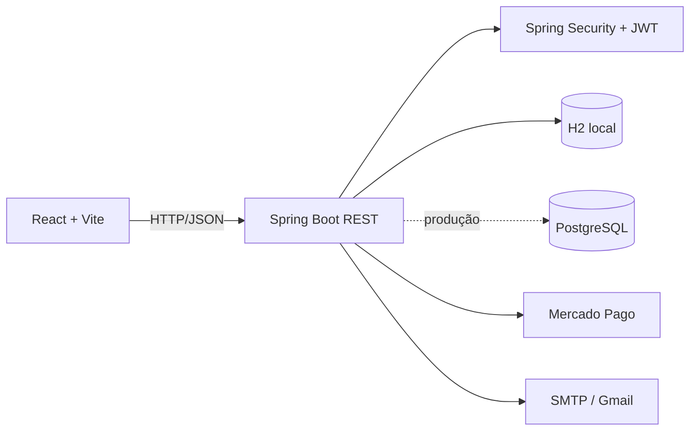

# HELP — Plataforma de desenvolvimento profissional


O **HELP** é uma plataforma acadêmica criada para aproximar candidatos, profissionais e empresas. O sistema reúne perfil profissional, feed, vagas, banco de talentos, mensagens, notificações, cursos, matrículas e pagamentos.

O repositório contém:

- backend REST em **Java 21, Spring Boot e Spring Security**;
- frontend em **React e Vite**;
- autenticação com **JWT**;
- banco local persistente com **H2**;
- suporte opcional a **PostgreSQL**;
- envio de e-mails por **SMTP/Gmail**;
- pagamentos de teste por **Mercado Pago**, com cartão e PIX.

## Sumário

- [Objetivo](#objetivo)
- [Funcionalidades](#funcionalidades)
- [Arquitetura](#arquitetura)
- [Tecnologias](#tecnologias)
- [Estrutura do repositório](#estrutura-do-repositório)
- [Pré-requisitos](#pré-requisitos)
- [Execução rápida com H2](#execução-rápida-com-h2)
- [PostgreSQL](#postgresql)
- [Autenticação e segurança](#autenticação-e-segurança)
- [Configuração de e-mail](#configuração-de-e-mail)
- [Mercado Pago](#mercado-pago)
- [Principais rotas](#principais-rotas)
- [Testes](#testes)
- [Autoria](#autoria)

## Objetivo

O HELP centraliza etapas importantes da jornada profissional:

- criação e atualização de perfil;
- conexão entre candidatos e empresas;
- consulta e publicação de vagas;
- banco de talentos para recrutamento;
- comunicação por mensagens e notificações;
- acesso a cursos gratuitos e pagos;
- matrícula confirmada por token;
- pagamento por cartão ou PIX.

A aplicação possui fluxos separados para **usuários/candidatos** e **empresas/RH**, com permissões específicas no backend.

## Funcionalidades

### Candidatos

- cadastro e login;
- autenticação JWT;
- recuperação de senha por e-mail;
- edição de perfil profissional;
- experiências e formação acadêmica;
- feed, seguidores e conexões;
- consulta de vagas;
- mensagens e notificações;
- área de cursos;
- matrícula gratuita por token;
- compra de curso com cartão ou PIX;
- confirmação de matrícula por código enviado por e-mail.

### Empresas e RH

- cadastro e login de empresa;
- autenticação específica para empresa;
- criação e exclusão de vagas;
- consulta ao banco de talentos;
- dashboard de recrutamento;
- acesso a perfis profissionais;
- mensagens e publicações.

### Pagamentos e matrículas

- tokenização do cartão no navegador pelo SDK do Mercado Pago;
- processamento da cobrança no backend;
- criação de pagamento PIX;
- consulta do status do pagamento;
- geração de código de matrícula;
- envio do código por e-mail;
- expiração de tokens de matrícula e recuperação.

## Arquitetura



O frontend consome a API Spring Boot em `http://localhost:8080`. Durante o desenvolvimento, o Vite normalmente utiliza `http://localhost:5173`.

O backend está organizado em controllers REST, services, repositories JPA, entidades, DTOs, validações, filtros e configuração de segurança.

## Tecnologias

### Backend

| Tecnologia | Uso |
|---|---|
| Java 21 | Linguagem principal |
| Spring Boot 3.5.10 | Base da API |
| Spring Web | Endpoints REST |
| Spring Data JPA | Persistência |
| Spring Security | Autenticação e autorização |
| Java JWT 4.4.0 | Tokens JWT |
| BCrypt | Hash de senhas |
| Bean Validation | Validação dos DTOs |
| Spring Mail | Envio de e-mails |
| H2 | Banco local persistente |
| PostgreSQL | Banco opcional para implantação |
| Mercado Pago SDK 2.1.19 | Cartão e PIX |
| Maven | Build e testes |
| Lombok | Redução de código repetitivo |

### Frontend

| Tecnologia | Uso |
|---|---|
| React 19 | Interface |
| Vite 7 | Desenvolvimento e build |
| React Router | Navegação |
| Axios / Fetch API | Comunicação com a API |
| Tailwind CSS 4 / CSS | Estilos |
| Lucide React | Ícones |
| PDF.js | Recursos de PDF |
| Emoji Picker React | Seleção de reações |

## Estrutura do repositório

```text
Help---TCC/
├── README.md
├── .gitignore
└── Help/
    ├── pom.xml
    ├── .env.example
    ├── src/
    │   ├── main/
    │   │   ├── java/com/example/Help/
    │   │   │   ├── Service/
    │   │   │   ├── model/
    │   │   │   ├── validation/
    │   │   │   └── HelpApplication.java
    │   │   └── resources/
    │   │       ├── application.properties
    │   │       └── application-local.properties
    │   └── test/
    └── frontend/
        ├── assets/
        ├── pages/
        ├── services/
        ├── src/
        ├── package.json
        └── postcss.config.js
```

## Pré-requisitos

- Java JDK 21;
- Maven 3.9 ou superior;
- Node.js 20 ou superior — Node 22 LTS é recomendado;
- npm;
- IntelliJ IDEA, VS Code ou outra IDE;
- Git.

O PostgreSQL não é obrigatório no modo local porque o projeto inicia com H2 por padrão.

## Execução rápida com H2

### 1. Clonar

```bash
git clone https://github.com/annygabb/Help---TCC.git
cd Help---TCC/Help
```

### 2. Backend

```bash
mvn spring-boot:run
```

Também é possível executar a classe `com.example.Help.HelpApplication` pela IDE.

Backend:

```text
http://localhost:8080
```

### 3. Frontend

Em outro terminal:

```bash
cd frontend
npm install
npm run dev
```

Frontend:

```text
http://localhost:5173
```

O backend e o frontend precisam permanecer em execução ao mesmo tempo.

### Build do backend

```bash
cd Help
mvn clean package
java -jar target/Help-0.0.1-SNAPSHOT.jar
```

### Scripts do frontend

| Comando | Descrição |
|---|---|
| `npm run dev` | Inicia o Vite |
| `npm run build` | Gera a versão de produção |
| `npm run preview` | Visualiza o build |

O frontend utiliza `HashRouter`. Exemplos:

```text
http://localhost:5173/#/login
http://localhost:5173/#/cadastro
http://localhost:5173/#/feed
http://localhost:5173/#/cursos
```

## PostgreSQL

Para usar PostgreSQL, defina um perfil diferente de `local`:

```text
SPRING_PROFILES_ACTIVE=prod
SPRING_DATASOURCE_URL=jdbc:postgresql://HOST:5432/BANCO?sslmode=require
SPRING_DATASOURCE_USERNAME=USUARIO
SPRING_DATASOURCE_PASSWORD=SENHA
```

O Hibernate está configurado com `spring.jpa.hibernate.ddl-auto=update`. Para produção, considere migrations com Flyway ou Liquibase.

## Autenticação e segurança

O projeto utiliza:

- Spring Security;
- autenticação stateless;
- JWT no cabeçalho `Authorization`;
- BCrypt para senhas;
- papéis de usuário, empresa e administrador;
- validações de dados;
- CORS para os endereços locais do frontend.

```http
Authorization: Bearer SEU_TOKEN_JWT
```

Nunca versione Access Token do Mercado Pago, senha de aplicativo do Gmail, senha do banco, `JWT_SECRET`, `.env` ou banco H2. Se uma credencial for publicada, revogue-a imediatamente.

## Configuração de e-mail

O envio usa Spring Mail e SMTP do Gmail na porta 465.

1. Ative a verificação em duas etapas da conta Google.
2. Acesse [Senhas de app](https://myaccount.google.com/apppasswords).
3. Crie uma senha para `Help TCC`.
4. Configure:

```text
SPRING_MAIL_HOST=smtp.gmail.com
SPRING_MAIL_PORT=465
SPRING_MAIL_USERNAME=seu-email@gmail.com
SPRING_MAIL_PASSWORD=senha-de-16-caracteres
```

Use a senha de aplicativo sem espaços. O remetente definido no código deve corresponder à conta autenticada.

O sistema envia e-mails de recuperação de senha, matrícula gratuita e matrícula paga.

## Mercado Pago

| Credencial | Local | Pode ir ao frontend? |
|---|---|---:|
| Public Key | Frontend | Sim |
| Access Token | Backend | Não |

O backend lê `MERCADOPAGO_ACCESS_TOKEN`. As credenciais precisam pertencer à mesma aplicação e ao mesmo ambiente.

### Cartão de teste

Consulte os dados atuais na [documentação do Mercado Pago](https://www.mercadopago.com.br/developers/pt/docs/your-integrations/test/cards).

Exemplo para aprovação:

| Campo | Valor |
|---|---|
| Número | `5480 8328 0103 3311` |
| Validade | `11/30` |
| CVV | `123` |
| Titular | `APRO` |
| CPF | `12345678909` |

No ambiente de teste, `APRO` simula aprovação.

### Fluxo do cartão

1. O frontend coleta os dados.
2. O SDK JavaScript cria um token temporário.
3. Apenas o token chega ao backend.
4. O backend cria a cobrança.
5. O status retorna ao frontend.
6. Após confirmação, o sistema gera o código de matrícula.

Dados completos do cartão não devem ser armazenados.

### PIX

O backend solicita o PIX, retorna QR Code/copia e cola quando disponíveis e consulta o status. A matrícula só deve ser liberada após confirmação.

## Principais rotas

| Método | Rota | Descrição |
|---|---|---|
| POST | `/usuarios/cadastro` | Cadastra usuário |
| POST | `/usuarios/login` | Login de usuário |
| PUT | `/usuarios/{id}` | Atualiza perfil |
| GET | `/usuarios` | Lista usuários autenticados |
| POST | `/usuarios/gerar-token` | Recuperação de senha |
| POST | `/usuarios/redefinir-senha` | Redefine senha |
| POST | `/empresas/cadastro` | Cadastra empresa |
| POST | `/empresas/login` | Login de empresa |
| GET | `/api/vagas` | Lista vagas |
| POST | `/api/vagas` | Cria vaga autorizada |
| DELETE | `/api/vagas/{id}` | Exclui vaga |
| POST | `/api/pagamento/cartao` | Processa cartão |
| POST | `/api/pagamento/pix` | Cria PIX |
| GET | `/api/pagamento/pix/status/{id}` | Consulta pagamento |
| POST | `/api/matricula/gerar-token` | Solicita código de matrícula |
| POST | `/api/matricula/confirmar` | Confirma matrícula |

Também existem módulos de perfil, cursos, feed, seguidores, mensagens, notificações e banco de talentos.

## Testes

### Backend

```bash
cd Help
mvn test
```

Pacote sem executar testes:

```bash
mvn clean package -DskipTests
```

Há testes relacionados a autenticação, usuários, cadastro, cursos, vagas, matrículas, tokens, integridade, tempo de resposta, rotas e feed.

### Frontend

```bash
cd Help/frontend
npm install
npm run build
```

## Autoria

Projeto acadêmico desenvolvido por **Anny Gabrielly** e colaboradores.

- GitHub: [@annygabb](https://github.com/annygabb)
- LinkedIn: [Anny Gabrielly](https://www.linkedin.com/in/annygabrielly/)
- Portfólio: [portfolioanny.vercel.app](https://portfolioanny.vercel.app/)
